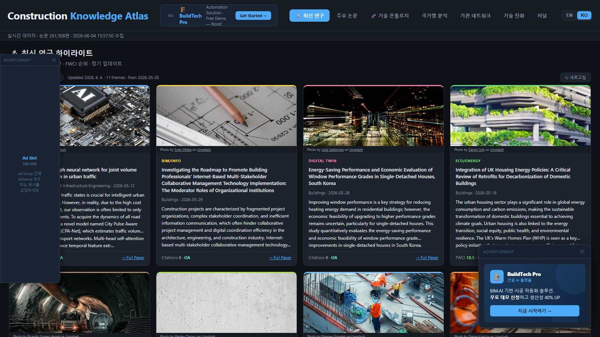
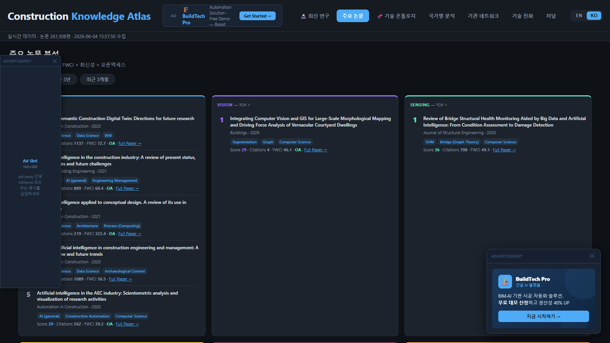
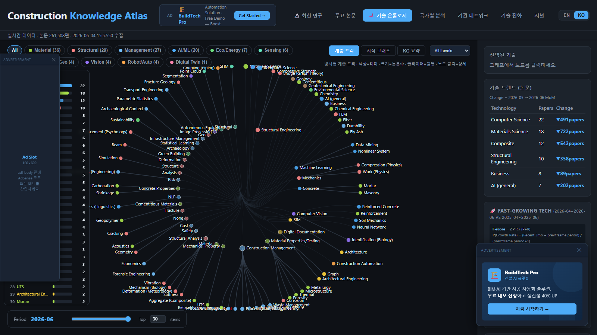
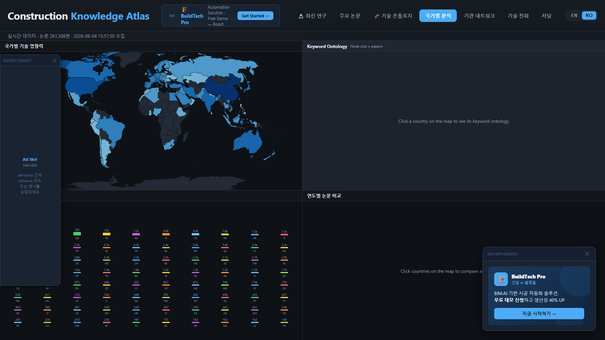
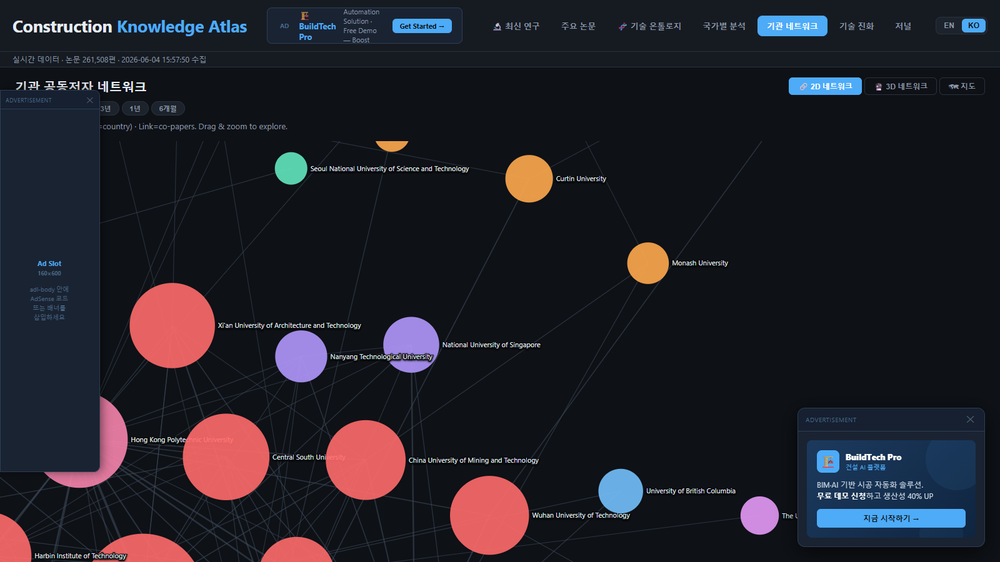
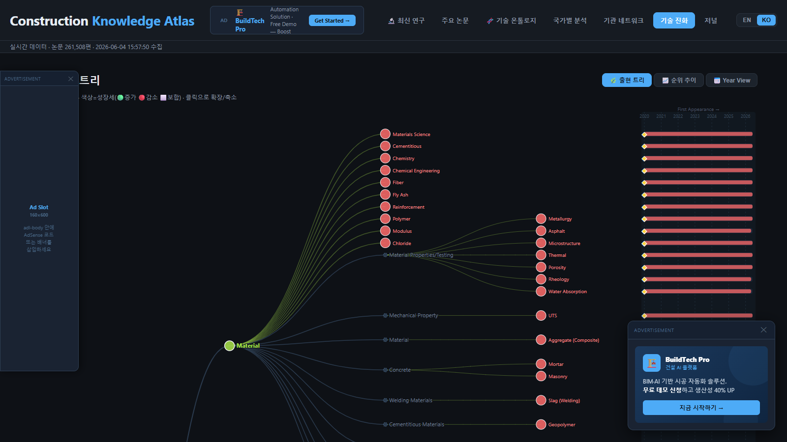
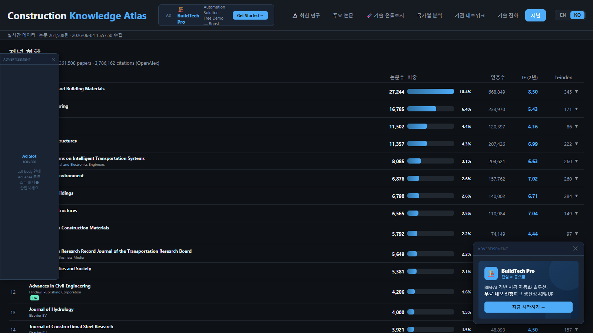

# 🏗️ Construction Knowledge Atlas

> **Interactive knowledge map of global construction technology research**

[](https://construction-knowledge-atlas.pages.dev)
[](https://construction-knowledge-atlas.pages.dev)
[](https://construction-knowledge-atlas.pages.dev)
[](#license)

## 🌐 Live Site

**[construction-knowledge-atlas.pages.dev](https://construction-knowledge-atlas.pages.dev)**

---

## 📖 Overview

Construction Knowledge Atlas is an interactive visualization platform for **260,000+ academic papers** from **222 journals** in the JCR categories:
- **CONSTRUCTION & BUILDING TECHNOLOGY** (95 journals)
- **ENGINEERING, CIVIL** (184 journals)

Supports **EN / KO** bilingual interface with automatic browser language detection.

---

## 📸 Screenshots

### 🔬 Latest Research Highlights
Top-cited recent paper per theme with auto-matched cover images.


### 🏆 Impact Paper Analysis
Papers ranked by composite impact score (Citations + FWCI + Recency + OA).


### 🧬 Tech Ontology
Interactive radial knowledge graph of construction technology concepts.


### 🌍 Country Analysis
World map, keyword ontology, paper rank, and annual comparison in one view.


### 🏛 Institution Co-author Network
Collaboration network by geographic location and force-directed graph.


### 📈 Tech Evolution
Year-by-year emergence of technology keywords.


### 📚 Journal Coverage
222 journals with official JCR metrics (IF, Quartile, Rank) + OpenAlex data.


---

## 📑 Pages & Features

### 🔬 Latest Research Highlights
Top-cited recent papers per research theme, FWCI-ranked and updated daily.
- 11 research themes: AI/ML, Vision, Material, Structural, Eco/Energy, Management, BIM, Geo, Robotics, Digital Twin, Sensing
- Unsplash images auto-matched per theme
- Last 7 / 30 day filter

---

### 🏆 Impact Paper Analysis
Papers ranked by composite impact score = Citations + FWCI + Recency + Open Access.
- Filter by theme, last 3 years, last 3 months
- Direct link to full paper (DOI)

---

### 🧬 Tech Ontology
Interactive visualization of construction technology concepts.

| Mode | Description |
|------|-------------|
| **Hierarchy Tree** | Radial tree — OpenAlex concept levels 0–5 |
| **Knowledge Graph** | Force-directed network, color = theme group |
| **KG Summary** | Theme-level bubble overview |

- Month slider for temporal trend analysis
- Top-N node filter (5–55)
- Theme group filter (11 groups)
- Click node → sidebar shows trend & related keywords

---

### 🌍 Country Analysis
World choropleth map of research output by country.
- Click country → Key institutions, top technologies, annual paper trend chart
- Multi-country comparison with line chart
- Keyword ontology force graph per country

---

### 🏛 Institution Co-author Network

| View | Description |
|------|-------------|
| **Force 2D** | D3 force-directed graph — drag & zoom |
| **Force 3D** | WebGL 3D network (3d-force-graph) |
| **Map** | Geographic placement on world map |

- Period filter: All Time / 3-Year / 1-Year / 6-Month
- Node color = country, node size = paper weight
- White link opacity = collaboration strength

---

### 📈 Tech Evolution
Technology emergence tracking over time.

| View | Description |
|------|-------------|
| **Emergence Tree** | Expandable tree of first-emerging tech keywords |
| **Rank Trend** | Bump chart — monthly rank trajectory |
| **Year View** | Animated bubble layout — keywords pop up year by year (2020→2025) |

- ★ marks new keywords appearing that year
- Auto-play with 1.8s interval

---

### 📚 Journal Coverage
Coverage statistics for 222 journals from JCR FA + IM categories.

| Column | Source |
|--------|--------|
| Papers, Citations | OpenAlex |
| IF (2yr), Quartile, Rank | JCR (Clarivate) — official data |
| h-index, OA Rate | OpenAlex |

- Expandable accordion per journal
- Year-by-year publication bar chart
- Link to journal homepage

---

## 🔬 Data Sources

| Source | Data |
|--------|------|
| [OpenAlex API](https://openalex.org/) | 260,000+ papers, citations, concepts, institutions |
| [JCR (Clarivate)](https://jcr.clarivate.com/) | Official IF, Quartile, Rank, Percentile |
| [Unsplash API](https://unsplash.com/developers) | Theme images for Latest tab |

**Journal coverage**: 222 journals from JCR CONSTRUCTION & BUILDING TECHNOLOGY (FA) and ENGINEERING, CIVIL (IM) categories, updated monthly via `jcr_categories.py`.

---

## 🔄 Automated Daily Updates

Runs every night at 03:00 via Windows Task Scheduler:

```
1. collect.py update      — fetch new papers since last run (incremental)
2. generate_latest.py     — update Latest tab with recent high-FWCI papers
3. make_scroll.py         — regenerate index2.html (scroll layout)
4. git push               — deploy to Cloudflare Pages
```

Monthly (1st of month): `jcr_categories.py` refreshes the JCR category journal list and metrics.

---

## 📦 File Structure

```
027_ConstructionKnowledgeAtlas/
├── index.html              # Main site (tab layout)
├── index2.html             # Scroll layout (auto-generated)
├── journal.html            # Individual journal profile pages
├── data/
│   ├── graph.json          # Tech ontology nodes + links
│   ├── papers.json         # Paper records (title, journal, score)
│   ├── country.json        # Country stats (top 80)
│   ├── network.json        # Institution co-author network + coords
│   ├── latest.json         # Latest high-FWCI papers per theme
│   ├── journals.json       # Journal list + paper counts
│   ├── journal_meta.json   # OpenAlex journal metadata
│   ├── jcr_categories.json # JCR FA+IM category journal metrics
│   ├── evolution.json      # Tech emergence timeline
│   ├── trend.json          # Monthly keyword trends
│   └── meta.json           # Collection metadata
├── collect.py              # Main data collection (OpenAlex)
├── generate_latest.py      # Latest papers + Unsplash images
├── jcr_auto.py             # JCR official IF/Quartile (single journal, API)
├── jcr_categories.py       # JCR category journal list (JIF/JCI/Quartile/Rank)
├── journal_meta_gen.py     # OpenAlex source metadata for all journals
├── jcr_parse.py            # JCR MHTML parser (offline fallback)
├── make_scroll.py          # Generate scroll layout from index.html
├── daily_update.ps1        # Automated daily update script
└── sitemap.xml
```

> **Note**: `data/_raw.json` (~1GB+ source data) is gitignored. Only processed output files are committed.

---

## 📄 License

Copyright © 2026 CKN Atlas. All rights reserved.
